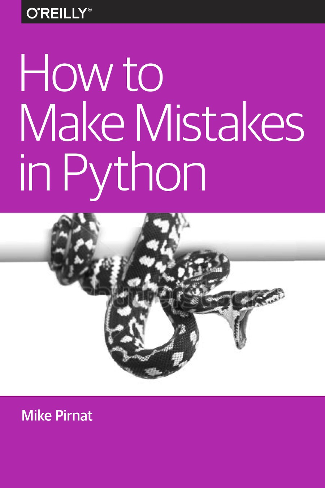

This year I was very absent from this blog. I apologize for that, but I have been extremely busy with work and some personal projects.

2019 is over and it may seem like I didn't write anything. In fact, I wrote a lot this year, I just didn't publish it here. I don't want to ruin the surprise, so I will wait until it is formally ready and then I will share it with you here.

However, I didn't read as much this year. I failed to accomplish my goal of reading 12 books trough the year. Some of the books I read were quite disappointing, but there were also a couple of nice surprises. I learned a lot, so that alone is a good outcome and what I am looking for. In this post, I will share a brief review of each of the books I read this year.

Traditionally, I wrote these yearly posts in Spanish. As you noticed, I decided to switch to English this time. While English is not my first language, my goal is to reach as many people as possible.

 
    

**01 &#8211; A feast for crows, by George R. R. Martin.**

> How much can a crown be worth, when a crow can dine upon a king?

> *Rule your face*, she told herself. *My smile is my servant, he should come at my command.*

From all the books in *A song of ice and fire*, this is probably the less confusing and most entertaining of them. Martin's skill as a writer seems to vary greatly. Some passages are beautiful and others are unbearably dull. Overall, I believe this is the best book of the series, so far.

&nbsp;

 
    

**02 &#8211; Machine learning, new and collected stories, by Hugh Howey.**

A short collection of already short science fiction stories, most of them focused on AI. Some of them are brilliant and most of them are pretty mediocre, not much else to say.

&nbsp;

 
    

**03 &#8211; Sapiens: A brief history of humankind, by Yuval Noah Harari.**

Absolutely fascinating. It pleasantly reminded me of &#8220;A short story of nearly everything&#8221;, but with a more serious tone and adding more topics like economy, racism, sexism and warfare. Probably the best book I read this year. The compelling way in which humankind's history is told in this book should be how schools teach it, for the sake of the students and future generations.

&nbsp;

 
    

**04 &#8211; The devil in the white city: Murder, magic, and madness at the fair that changed America, by Erik Larson.**

> That night the exposition illuminated the fairgrounds one last time. "Beneath the stars the lake lay dark and sombre," Stead wrote, "but on its shores gleamed and glowed in golden radiance the ivory city, beautiful as a poet's dream, silent as a city of the dead."

A real story of a psycho killer. Set in Chicago during the first World Fair, an apparently normal and charismatic pharmacist who called himself H. H. Holmes settled and silently started deceiving and killing people, particularly young women. The author performed a magnificent research work about the way of life during that period and specially about the planning, design, construction and eventual destruction of the World Fair grounds. In fact, his research was so meticulous that the part of the book that talks about it can be tiresome and quite boring. Historians would find this book fascinating, but I am sure most people would read this book in order to satisfy that dubious fascination most people have with serial killers.

&nbsp;

 
    

**05 &#8211; A dance with dragons, by George R. R. Martin.**

> Maester Aemon wiped his nose. "Knowledge is a weapon, Jon. Arm yourself well before you ride forth to battle."

> No man would mourn the thing he'd become. *I'll haunt the Seven Kingdoms*, he thought, sinking deeper. *They would not love me living, so let them dread me dead*.

> "A reader lives a thousand lives before he dies," said Jojen. "The man who never reads lives only one."

Incredibly boring and disappointing. Being one of the longest stories in the series, yet offering basically no content in terms of story or character development. I really don't think I will continue reading the next books after this, if George R. R. Martin manages to write them, that is.

&nbsp;

 
    

**06 &#8211; The cathedral and the bazaar, by Eric S. Raymond.**

> Every good work of software starts by scratching a developer's personal itch.

> Good programmers know what to write. Great ones know what to rewrite (and reuse).

> If you have the right attitude, interesting problems will find you.

> "Perfection (in design) is achieved not when there is nothing more to add, but rather when there is nothing more to take away."

> To solve an interesting problem, start by finding a problem that is interesting to you.

> Perhaps in the end the open-source culture will triumph not because cooperation is morally right or software "hoarding" is morally wrong (assuming you believe the later, which neither Linus nor I do), but simply because the closed-source world cannot win an evolutionary arms race with open-source communities that can put orders of magnitude more skilled time into a problem.

> Our creative play has been racking up technical, market-share, and mind-share successes at an astounding rate. We're proving not only that we can do better software, but that joy is an asset.

> When programmers are held both to an immutable feature list and a fixed drop-dead date, quality goes out of the window and there is likely a colossal mess in the making.

A very interesting short book about the open source movement and its influence in the business world. It talks about the history of code collaboration and his personal story about contributing to an email client. This is a one of the must-read books for anybody trying to learn about free and open source culture.
As you see in the quotes listed above, it also includes brilliant insights about the development process.
I highly recommend it, but I wish there would be a new edition including the newest developments in the software industry, including continuous integration and delivery and other version control systems.

&nbsp;

 
    

**07 &#8211; The phoenix project, by Gene Kim, Kevin Behr and George Spafford.**

&nbsp;

An attempt at writing a technical book and disguise it as a novel. Middle managers who have been thrown into the DevOps craze will love this book as they will instantly see themselves in the protagonist, who suddenly is put in charge of the whole IT department of a company facing the threat of a possible bankruptcy due to the rival companies that are always one step ahead at adopting those mysterious new IT practices. No wonder this book was recommended in every single IT meetup I attended this year, while discussing "how we adopted DevOps".
This book has all the ridiculous clichés from the corporate world: The power-hungry female executive, the incompressible and eccentric tech-hippie mentor, the rockstar developer who works 25 hours a day, the basic white family in a picked-fenced suburban home rooting for daddy, etc.
Yes, I would recommend this book as an introduction to DevOps adoption in the workplace, but it is neither a good technical book nor a good novel. Besides, reading it feels like going back to put out fires at work on your free time, so take that into consideration. It would be better to spend your time reading a good DevOps book or a good novel.

&nbsp;

 
    

**08 &#8211; Migrating to cloud-native application architectures, by Matt Stine**

&nbsp;

Everybody is ~~kung-fu fighting~~ migrating to the cloud these days due to the seemingly unparalleled possibilities it grants when it is done correctly. Monolithic applications just don't make sense anymore and Matt Stine provides a great parting point in how to approach the modernization of software in the enterprise.

&nbsp;

 
    

**09 &#8211; Kubernetes up and running, by Kelsey Hightower, Joe Beda and Brendan Burns.**

&nbsp;

Kubernetes seems to be the trendy technology right now, but it is much more than just a trend. The containers revolution just started the need to manage and organize those containers in a way that makes sense. Kubernetes (and other efforts like Docker Swarm) were born from that need.

This is easily one of the best technical books I've read. It clearly explains the Kubernetes ideology and how to take advantage of its capabilities. This is a must read for anybody who has any kind of interaction with Kubernetes.

&nbsp;

 
    

**10 &#8211; How to make mistakes in Python, by Mike Pirnat.**

&nbsp;

> Above all, be on your guard. Trust no one--least of all yourself!

This is a nice short report on Python coding best practices. The author has spent more than 15 years writing Python code so he has also made quite a few mistakes (as we all have). Most of these mistakes are easy to make and I've seen and made several of them. The report draws inspiration from the legendary "Clean Code" by Robert Martin, so it is a worthwhile read.
Hopefully we would see longer editions of this, and maybe even see a "Making mistakes" series, including other programming languages.

&nbsp;
