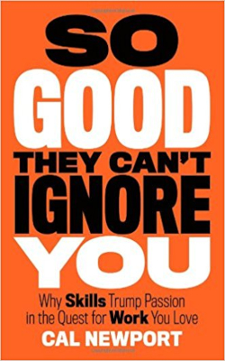
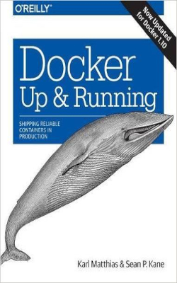
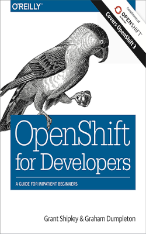
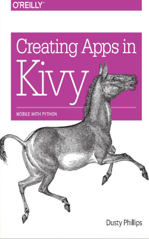
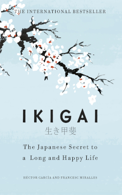
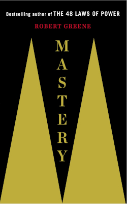
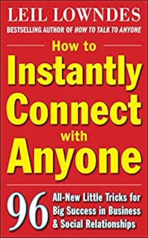

&nbsp;&nbsp;&nbsp;&nbsp;
The end of another year is here and that means I should take a moment to reflect and meditate about this year's events. If you have read the previous years' entries you may be aware that, at least for me, each year has been much more chaotic than the last.

&nbsp;&nbsp;&nbsp;&nbsp;
Well, 2020 really outdid itself. The funny thing is, I was expecting to be part of a global pandemic at some time in my life, but I also was expecting many more zombies in it.

&nbsp;&nbsp;&nbsp;&nbsp;
Unfortunately, many people died (and continue to die), including people close to me. This makes me appreciate that I still have the opportunity to do the things I love, like reading.

&nbsp;&nbsp;&nbsp;&nbsp;
Due to the lockdown, I was "forced" to work from home during most of the year, which meant I did not spend any more time commuting, which in turn meant I spent less time reading, hence the short list this year. I consider this a failure on my part, but, as always, there were some very good surprises in terms of literature.

&nbsp;&nbsp;&nbsp;&nbsp;
Anyway, here's this year's list.

---

 
    

**01 - *So good they can't ignore you*, by Cal Newport.**

> To successfully adopt the craftsman mindset, therefor, we have to approach our jobs in the same way that Jordan approaches his guitar playing or Garry Kasparov his chess training-with a dedication to deliberate practice.

> Doing things we know how to do well is enjoyable, and that's exactly the opposite of what deliberate practice demands... Deliberate practice is above all an effort of focus and concentration. That is what makes it "deliberate," as distinct from the mindless playing of scales or hitting of tennis balls that most people engage in.

> If you're not uncomfortable, then you are probably stuck at an "acceptable level".

> Hardness scares off the daydreamers and the timid, leaving more opportunity for those like us who are willing to take the time to carefully work out the best path forward and then confidently take action.

&nbsp;&nbsp;&nbsp;&nbsp;
This is a fantastic book that rebels against the old advice that every young person hears at some point in their lives: *"You just have to follow your passion"*. Newport argues that this is the worst advice you can give to anybody since those passions may be completely useless and produce no financial gain or personal satisfaction.

&nbsp;&nbsp;&nbsp;&nbsp;
At the same time, the author provides a better strategy to achieve both professional and personal fulfillment: *"being so good they can't ignore you"*, which means investing your time wisely in improving your skills, networking with the right people and understanding the general landscape of the field.
The book includes numerous examples of people that blindly attempted their dreams without any thought or plan (and failed miserably) and others who gained fame, fortune, and personal satisfaction just by being smart about their objectives and their daily routines.

&nbsp;&nbsp;&nbsp;&nbsp;
Definitely a book that is worth reading by anybody in any field because its main message is none other that the pursue of perfection from a modern angle. I really wish more teenagers (or really, anybody) would read it before making unwise decisions.

---

 
    

**02 - *Docker up and running*, by Karl Matthias and Sean P. Kane.**

&nbsp;&nbsp;&nbsp;&nbsp;
I love the idea behind the "up and running" books: A simplified look at technologies for people who only want a no-nonsense understanding of how they fit in the big picture of today's IT landscape.

&nbsp;&nbsp;&nbsp;&nbsp;
From a few years ago, containers have revolutionized the procedures and practices in the software development industry. At the forefront of this is Docker, which is by far the most used container technology.

&nbsp;&nbsp;&nbsp;&nbsp;
This book is a very enjoyable way to understand what Docker is and the many ways in which it can help to make our lives easier. If are a software developer or your work is in any way related to software development, this book is an excellent entry point (pun intended) for this revolutionary technology.

---

 
    

**03 - *OpenShift for developers*, by Grant Shipley and Graham Dumpleton.**

&nbsp;&nbsp;&nbsp;&nbsp;
A very brief book about RedHat's OpenShift. Just enough to get you started. I was looking a book similar to *Docker up and running* but for OpenShift and this one was perfect. It skips the boring parts and goes straight to the point, explaining what OpenShift is and its many advantages.

&nbsp;&nbsp;&nbsp;&nbsp;
If you want or need to learn OpenShift quickly, this is a great option.

---

 
    

**04 - *DevOps with OpenShift*, by Stefano Picozzi, Mike Hepburn and Noel O'Connor.**

&nbsp;&nbsp;&nbsp;&nbsp;
I wanted to continue reading about OpenShift and I choose this book because it is some sort of "unofficial continuation" of the previous one, expanding on the same topics and adding even more. This book was harder to read since it was not as succinct, so I would only recommend it if you truly want to immerse yourself in the internals of OpenShift.

---

 
    

**05 - *Creating apps in Kivy*, by Dusty Phillips.**

> The world is coming to entirely depend on technology, and we need to welcome the inexperienced users, make them feel comfortable, help them become adept, and, if we are lucky, prompt them to become new developers themselves. The generation of children who grew up on locked-down tablets and mobile phones never had a chance to explore and experiment, to break and fix things.

&nbsp;&nbsp;&nbsp;&nbsp;
Kivy is a Python framework that provides an easy way to deliver GUI-based applications that are also platform-independent. This book really helped me to understand some key aspects of Kivy that I was having a hard time to understand since it was my first "serious" attempt at making more user-friendly applications.

&nbsp;&nbsp;&nbsp;&nbsp;
I really hope Kivy gains more popularity since it is an interesting project. This includes more people learning about it and for that we need more people writing books and tutorials like this one.

---

 
    

**06 - *Ikigai*, by Héctor García and Francesc Miralles.**

&nbsp;&nbsp;&nbsp;&nbsp;
This book is an attempt to find the secret to a happy and long life. In this effort, many old people were interviewed and they shared what they think their secret is. Of course, there is no real fountain of youth, and actually some of them are even contradictory: Drink wine, don't drink wine, eat meat, don't eat meat, spend time with your friends and family, eat vegetables, exercise a lot, sleep a lot, drink tea, etc.

&nbsp;&nbsp;&nbsp;&nbsp;
However, the part that really made sense for me is the search for *ikigai*-The activity in which you are good at, makes you happy, is useful to others, and provides sustenance. Maybe the secret to a long life will remain a mystery, but living a fulfilled life seems the obvious result of finding something that satisfies those four requirements.

&nbsp;&nbsp;&nbsp;&nbsp;
This book seems the perfect companion to *"So good they can't ignore you"* since it discusses basically the same subject, from two very different points of view.

---

 
    

**07 - *Mastery*, by Robert Greene.**

&nbsp;&nbsp;&nbsp;&nbsp;
This is the third book I've read from Robert Greene and so far I've loved all of them. *Mastery* analyzes how great minds achieve what is only a dream for others. It completely destroys the myth of the genius that appears spontaneously with exceptional and unparalleled talent. Mastery, Greene concludes, is the result of obsessive practice, slowly perfecting one's technique trough imitation, improvisation, rebellion against the *status quo* and contemplation of past attempts.

&nbsp;&nbsp;&nbsp;&nbsp;
The lives of several masters in their respective fields are studied extensively, including Leonardo da Vinci, Albert Einstein, Benjamin Franklin, Charles Darwin, and others that are much more contemporary like Teresita Fernandez, Paul Graham, Santiago Calatrava and Cesar Rodriguez.

&nbsp;&nbsp;&nbsp;&nbsp;
Here lies the part that I didn't like about this book, some of these masters are discussed over and over again from slightly different points of view. This makes the book extremely repetitive in some parts and I which other people's stories would have been included in order to avoid this problem. Surely there have been other masters in human history that are worth studying.

&nbsp;&nbsp;&nbsp;&nbsp;
As I wrote above, I loved this book even with its problems. I like that Robert Greene provides solid and clear advice for people attempting to improve themselves and avoids resorting to superstition and religious dogma that so many "self-help" authors cowardly use. With that said, I think *Outliers* by Malcolm Gladwell (which [I read in 2018](http://kippel.net/blog/libros-2018)) is an even better book on this subject.

---

 
    

**08 - *How to instantly connect with anyone*, by Leil Lowndes.**

&nbsp;&nbsp;&nbsp;&nbsp;
This is a short audiobook I randomly found, but I have to say it was much better than I expected.

&nbsp;&nbsp;&nbsp;&nbsp;
Some of the advice it delivers seems obvious at first, but I noticed that it revolves around actually listening and paying attention to what people care about (which is mostly themselves) and being empathetic, which is something we rarely do. Once that is done, all will fall into place and people will inadvertently feel drawn to you.

&nbsp;&nbsp;&nbsp;&nbsp;
It is hard not to recommend this book since it goes straight to the point and it is so short. If you have a couple of extra hours and do not have anything else to read, this is a good option.
